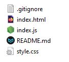

# Коллекция JavaScript скриптов для инициализации

## Инициализация пустого проекта HTML + JavaScript

Файл `InitJS.js` запрашивает название страницы и создает в текущей директории:

- файл `index.html` из шаблона `htmlTemplate.html` с названием, введенным при запуске, и с уже подключенным скриптом `index.js`
- пустой файл `index.js`
- пустой файл `style.css`
- пустой файл `README.md`
- файл `.gitignore` с папкой "**node_modules/**" из шаблона `template.gitignore`

Шаблон `htmlTemplate.html` содержит минимальный набор тегов для веб-страницы (emmet !).

## Инициализация пустого компонента React JS

Файл `newComp.js` запрашивает название нового пустого компонента React и создает в текущей директории:

- пустой файл `<имя>.css`
- файл `<имя>.js` из шаблона `jsReactCompTemplate.js`

Введенное название активно используется внутри `<имя>.js` для переменных и ссылок: подключается CSS, дается название главной функции рендера и ее экспорт/импорт. Кроме этого шаблон `jsReactCompTemplate.js` содержит часто используемые строки кода для хуков **useState** и **useEffect**.
